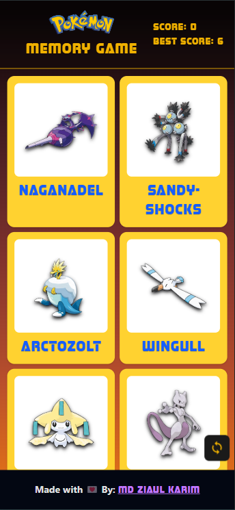
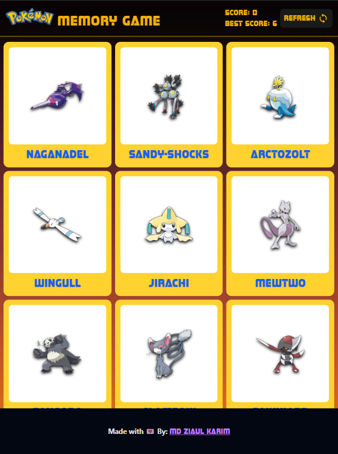
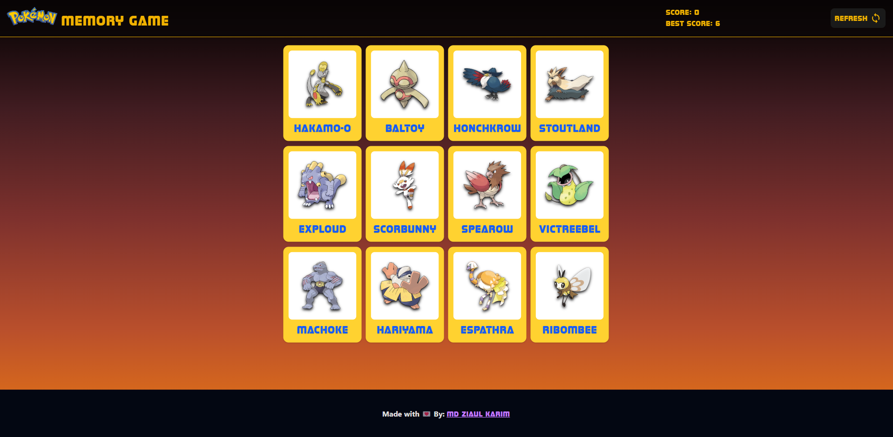

## Pokemon memory game

- A simple game made utilizing the [Pokemon API](https://pokeapi.co/)

### Phone

### Tablets

### Desktop

<h2 align="center">
Powered by
</h2>

  &nbsp;&nbsp;&nbsp; &nbsp;&nbsp;&nbsp; &nbsp;&nbsp;&nbsp;

<h5 align="center">
I love Pikachu 😍
</h5>